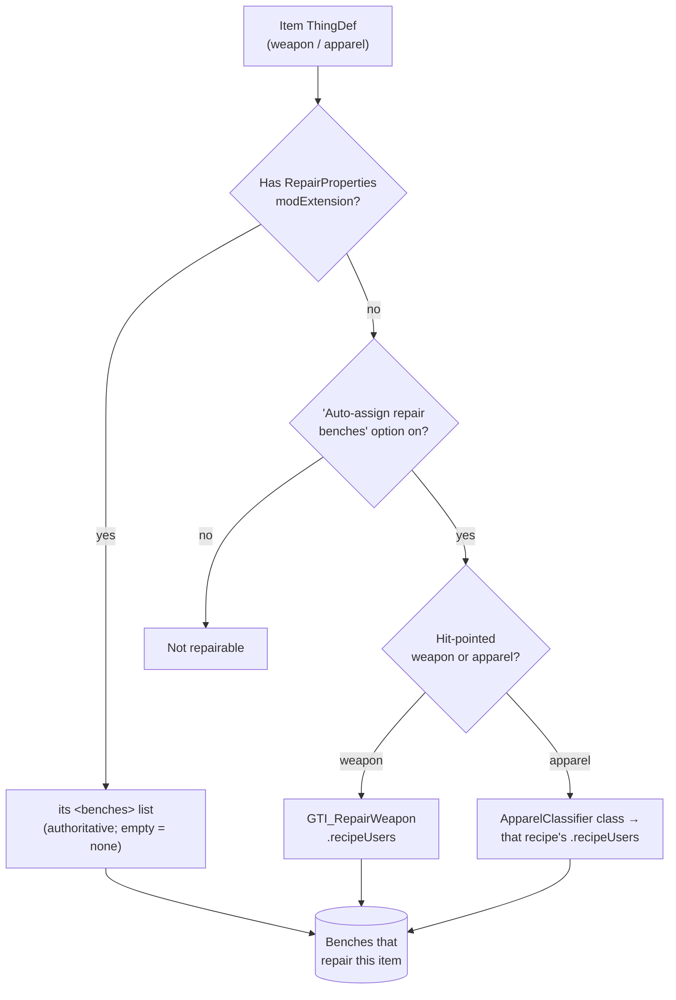
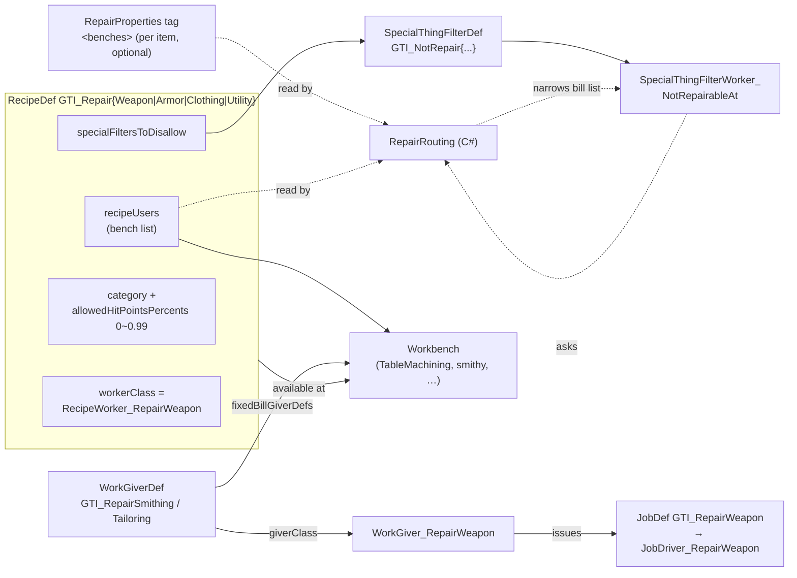

# GTI Weapon Wear — XML Configuration Reference

How the mod's XML is structured and how the pieces tie together. Companion to
[`CODE_REFERENCE.md`](CODE_REFERENCE.md) (the C# side) and
[`ModFiles/DOCUMENTATION.md`](ModFiles/DOCUMENTATION.md) (gameplay/design). Use this when you want to
change routing, add a bench, mark an item non-repairable, or write a cross-mod patch.

All XML lives under `ModFiles/` and is deployed verbatim:

```
ModFiles/
├── Defs/
│   ├── RecipeDefs/GTI_RepairRecipes.xml              4 repair recipes
│   ├── SpecialThingFilterDefs/GTI_RepairFilters.xml  4 bill-list filters
│   ├── WorkGiverDefs/GTI_WorkGivers.xml              2 work givers
│   └── JobDefs/GTI_Jobs.xml                          2 job defs
└── Patches/
    ├── EquippedWeaponRepair_ThinkTree.xml           inserts the auto-repair think node
    ├── Compat_RepairBench.xml                       reroute-all to the "Repair Workbench" mod
    └── Examples/RepairRouting_Example.xml(.xm_)     per-item routing template (disabled)
```

The per-item routing tag (`RepairProperties` modExtension) is **not** a file of its own — it is added
onto item `ThingDef`s by patches (yours or the shipped example).

---

## The big picture

There are two concerns, and they meet in one C# resolver:

1. **"Which bench repairs this item, if any?"** — decided by `RepairRouting` (C#). It reads the
   per-item `RepairProperties` tag first; if absent, it falls back to the built-in classification
   (which itself reads bench lists out of the recipes). This can be switched off in mod options.
2. **"How does a repair actually get done at a bench?"** — the vanilla bill system: a **RecipeDef**
   provides the bill + item filter, a **SpecialThingFilterDef** narrows the bill list to the items
   routed to that bench, a **WorkGiverDef** makes pawns service the bench, and a **JobDef** runs the
   incremental repair.

The single link between the two: each repair recipe's `<recipeUsers>` **is** the canonical bench list
— read both by the bill system (where the recipe is available) and by `RepairRouting` (the fallback
answer + the filters' "my benches").

### Illustration 1 — "Which bench repairs an item?"



This one decision answers the bench question for **all three** repair paths alike — bench bills, the
right-click "Repair … now" option, and **equipped-weapon auto-repair**. The `RepairProperties` tag is
an **override, not a prerequisite**: an un-tagged item still resolves to a bench through the fallback
(e.g. an ordinary weapon → the machining table), so auto-repair works on un-tagged weapons too. The
flow yields *no* bench — so nothing, including auto-repair, will service the item — only when the item
is tagged non-repairable (empty `<benches/>`) or is un-tagged with the fallback option turned off.
(Auto-repair additionally has its own gates: the on/off switch, the HP threshold, an undrafted
Manipulation-capable player pawn, and available materials.)

### Illustration 2 — how the defs wire together (the bill system)



Plain-text version of illustration 2:

```
RepairProperties.<benches> ─┐
recipeUsers (bench list) ───┼─→ RepairRouting (C#) ─→ used by the filters,
                            │                          the work giver, and
                            │                          equipped-weapon auto-repair
RecipeDef ──────────────────┘
  ├─ category + HP filter 0~0.99   (what's eligible)
  ├─ specialFiltersToDisallow ─→ SpecialThingFilterDef ─→ Worker ─(asks)→ RepairRouting
  ├─ recipeUsers ─────────────→ Workbench  (recipe available here)
  └─ workerClass = RecipeWorker_RepairWeapon  (marker + in-place fallback)

WorkGiverDef ─ fixedBillGiverDefs ─→ Workbench
            └ giverClass WorkGiver_RepairWeapon ─→ JobDef ─→ JobDriver  (incremental repair)
```

---

## File-by-file

### `Defs/RecipeDefs/GTI_RepairRecipes.xml` — the four repair recipes

One recipe per bench-group. They are the heart of the config: they provide the bill UI, the eligible
item set, and the canonical bench list.

| defName | `category` | disallows filter | default `recipeUsers` |
|---|---|---|---|
| `GTI_RepairWeapon` | Weapons | `GTI_NotRepairWeapon` | `TableMachining` |
| `GTI_RepairArmor` | Apparel | `GTI_NotRepairArmor` | `ElectricSmithy`, `FueledSmithy` |
| `GTI_RepairClothing` | Apparel | `GTI_NotRepairClothing` | `ElectricTailoringBench`, `HandTailoringBench` |
| `GTI_RepairUtility` | Apparel | `GTI_NotRepairUtility` | `FabricationBench` |

Key fields (shared):
- `<workerClass>GTI_WeaponWear.RecipeWorker_RepairWeapon</workerClass>` — the **marker** the WorkGiver
  and the Harmony skip-patch use to recognise a repair bill; also the in-place repair fallback.
- `<ingredients>` / `<fixedIngredientFilter>` — `<categories>` (Weapons or Apparel) plus
  `<specialFiltersToDisallow>` naming this recipe's filter, plus `<allowedHitPointsPercents>0~0.99`
  (only damaged items qualify). **No material ingredient is listed** — the cost is computed per item
  at runtime (`WeaponRepairCost`).
- `<recipeUsers>` — the benches this recipe is available at. **This is the bench list `RepairRouting`
  reads** (both as the no-tag fallback and as each filter's "my benches"). Edit this to add/replace a
  bench for a whole category.
- `<defaultIngredientFilter>` — the *initial* state of a new bill's filter. Each recipe disallows the
  vanilla `AllowDeadmansApparel` (tainted) + `AllowBiocodedApparel`, or `AllowBiocodedWeapons`, here,
  so **new repair bills exclude tainted/biocoded gear by default**. These are not in
  `fixedIngredientFilter`, so a player can re-enable them per bill. (Equipped-weapon auto-repair uses
  a custom job, not the bill filter, so it still repairs biocoded weapons.)

### `Defs/SpecialThingFilterDefs/GTI_RepairFilters.xml` — bill-list narrowing

Four `SpecialThingFilterDef`s, one per recipe, each pointing at a thin
`SpecialThingFilterWorker_NotRepair{Weapon|Armor|Clothing|Utility}` subclass. The recipe **disallows**
its filter, so the bill list keeps only items routed to that recipe's benches. See
[`CODE_REFERENCE.md`](CODE_REFERENCE.md) for why this is phrased negatively (RimWorld's special
filters are subtractive by design).

| defName | `parentCategory` | worker |
|---|---|---|
| `GTI_NotRepairWeapon` | Weapons | `…_NotRepairWeapon` |
| `GTI_NotRepairArmor` | Apparel | `…_NotRepairArmor` |
| `GTI_NotRepairClothing` | Apparel | `…_NotRepairClothing` |
| `GTI_NotRepairUtility` | Apparel | `…_NotRepairUtility` |

You normally never touch these; they react automatically to `recipeUsers` and per-item tags.

### `Defs/WorkGiverDefs/GTI_WorkGivers.xml` — who services the benches

Two `WorkGiverDef`s, both using `giverClass GTI_WeaponWear.WorkGiver_RepairWeapon`. Split because a
`WorkGiverDef` carries a single `workType`:

| defName | `workType` | `priorityInType` | `fixedBillGiverDefs` |
|---|---|---|---|
| `GTI_RepairSmithing` | Smithing | 120 | `TableMachining`, `ElectricSmithy`, `FueledSmithy`, `FabricationBench` |
| `GTI_RepairTailoring` | Tailoring | 115 | `ElectricTailoringBench`, `HandTailoringBench` |

If you add a bench to a recipe's `recipeUsers`, also add it to the matching work giver's
`fixedBillGiverDefs` (same work-type family) so pawns actually scan it.

### `Defs/JobDefs/GTI_Jobs.xml` — the repair jobs

- `GTI_RepairWeapon` → `JobDriver_RepairWeapon` (bench-bill repair).
- `GTI_RepairEquippedWeapon` → `JobDriver_RepairEquippedWeapon` (auto-repair of a pawn's own weapon).

No configuration to tweak here.

### `Patches/EquippedWeaponRepair_ThinkTree.xml` — auto-repair hook

A `PatchOperationInsert` that drops `JobGiver_RepairEquippedWeapon` into the Humanlike think tree,
right after the apparel optimizer (so it runs in spare time, no work type required). The bench it
sends a pawn to comes from `RepairRouting.BenchesFor(weapon.def)`, so it follows the same routing as
everything else.

### `Patches/Examples/RepairRouting_Example.xm_` — the per-item routing template

Disabled (`.xm_`). Rename to `.xml` to try it, or copy the operations into your own patch. Shows the
two things a per-item tag can do (see next section).

### `Patches/Compat_RepairBench.xml` — reroute everything to one mod's bench

Gated by `PatchOperationFindMod` on **Repair Workbench** (`Acruid.RepairBench`). When that mod is
present it: moves `GTI_RepairWeapon` to the mod's `ElectricTableRepair` (keeping its filter, so the
weapon bill stays weapons-only); takes the three apparel category recipes off all benches (empty
`recipeUsers`); adds one unfiltered `GTI_RepairApparel` recipe at the bench (a single "repair apparel"
bill covering all apparel); and adds one `Crafting`-work-type `WorkGiverDef` (`GTI_RepairAtRepairBench`)
to service it. Result: two non-overlapping bills at the bench.

Why not four bills at the one bench? The per-bench filter distinguishes recipes **by their bench set**
— if multiple category recipes share a single bench, none can be told apart and every apparel bill
shows every apparel item. A shared bench therefore collapses to at most two clean bills
(weapons via `category`, plus one all-apparel bill). A worked template for "send all repairs to bench X".

---

## The per-item tag: `RepairProperties` modExtension

This is the data-driven override — the authoritative answer to "where (and if) is this item repaired".
Add it to any weapon/apparel `ThingDef` with a patch:

```xml
<!-- Route flak vests to the tailoring benches instead of the smithy -->
<Operation Class="PatchOperationAddModExtension">
  <xpath>/Defs/ThingDef[defName="Apparel_FlakVest"]</xpath>
  <value>
    <li Class="GTI_WeaponWear.RepairProperties">
      <benches>
        <li>ElectricTailoringBench</li>
        <li>HandTailoringBench</li>
      </benches>
    </li>
  </value>
</Operation>

<!-- Mark an item NON-repairable: present tag, empty benches -->
<Operation Class="PatchOperationAddModExtension">
  <xpath>/Defs/ThingDef[defName="Gun_Autopistol"]</xpath>
  <value>
    <li Class="GTI_WeaponWear.RepairProperties"><benches /></li>
  </value>
</Operation>
```

Rules:
- **Tag present, ≥1 bench** → repairable at exactly those benches (overrides everything).
- **Tag present, empty `<benches/>`** → explicitly never repairable.
- **No tag** → built-in fallback (and that fallback can be turned off in options).

The `<xpath>` chooses *which* items — one def, or a group, e.g. `/Defs/ThingDef[apparel/layers/li="Belt"]`.

---

## Common tasks

**Re-route one item to a different bench** → add a `RepairProperties` tag pointing at that bench
(same-category bench; see caveat). Nothing else needed — the filters, work giver, and equipped-weapon
auto-repair all follow.

**Make an item non-repairable** → `RepairProperties` with empty `<benches/>`.

**Add a brand-new bench that repairs a category** → add the bench `<li>` to the matching recipe's
`<recipeUsers>` **and** to the matching work giver's `<fixedBillGiverDefs>`.

**Send everything to one bench** → see `Patches/Compat_RepairBench.xml` as a template.

**Turn off the built-in fallback** → mod options → *Repairs* → uncheck *Auto-assign repair benches for
un-tagged items*. Then only tagged items are repairable.

---

## Caveat: the category split

The four recipes keep their `category` (Weapons vs Apparel). A bench only repairs an item if it hosts
a recipe whose category covers that item:

- Re-routing **apparel between apparel benches** works with a tag alone (all three apparel recipes
  share the `Apparel` category).
- Re-routing a **weapon to a non-weapon bench** (or apparel to the machining table) also requires
  adding that bench to the matching recipe's `recipeUsers` so a recipe of the right category exists
  there. A tag alone is not enough across categories.
